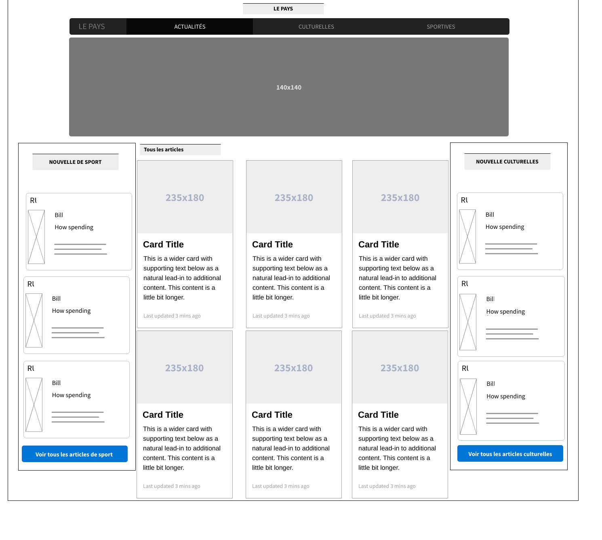
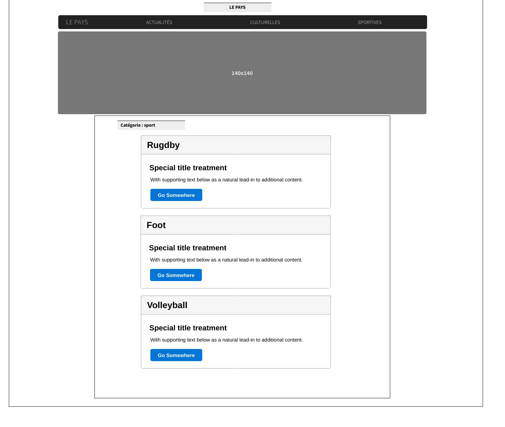
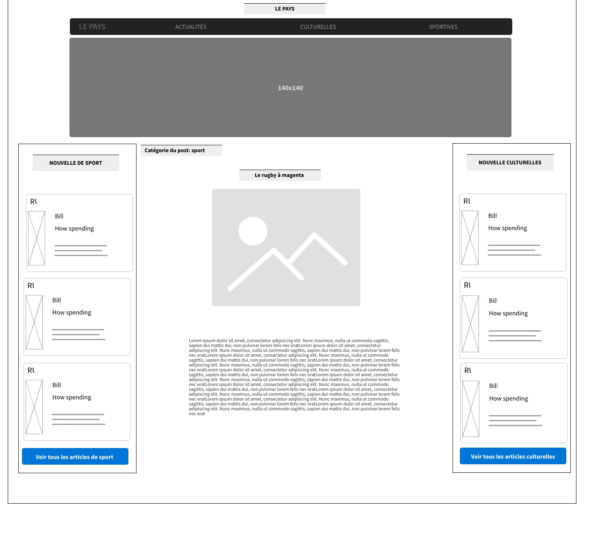

# Le Pays - Cahier des charges

-   A.	1. Les objectifs du site 
-   A.	2. Les cibles 
-   B.	Graphisme et ergonomie
-   B.  1. La charte graphique
-   B.  2. Wireframe et Maquettage
-   C.  Spécificités et livrables 
-   C.  1. Le contenu de votre site 
-   C.  2. Contraintes techniques 
-   C.  3. Le Planning

## A. 1. LES OBJECTIFS DU SITE :

Le journal local “Le Pays” est une entreprise de nouvelle il souhaite se moderniser et créer un site internet pour relayer les informations de sa version papier.

## A. 2. LES CIBLES :

Le journal a pour réputation de relayer les activités sportives et culturelles du pays, il est donc normal pour l’entreprise de ciblé ces types de lecteur.
 Enfin, monsieur Do souhaite rendre ce site internet accessible sur mobile, car il veut atteindre des lecteurs plus jeunes et familiarisés avec la technologie. 

## B. GRAPHISME ET ERGONOMIE :

- Le site doit être facile de navigation, et doit faciliter la lecture des articles auprès des lecteurs (contraste des couleurs, taille de la police et choix de la police).

## B. 1. LA CHARTE GRAPHIQUE :

Monsieur Do le directeur du journal, est très attaché au papier et au confort de lecture que peut fournir ce support. Il souhaite donc que le site soit simple d’utilisation et aussi agréable à la lecture que sa version papier. 

<strong>Exemple : https://www.lemonde.fr/</strong>

## B. 2. WIREFRAME ET MAQUETTAGE :

Les maquettes contiennent :

• L’arborescence du site 

- • Une page « A la Une ! »
- • Une partie événement sera sur la page « A la Une ! »
- • Une page « tous les articles ! »
- • Une page « Activités culturelles »
- • Une page « Activités sportives »

 

 

 

## C. SPECIFICITES ET LIVRABLES :

## C. 1. CONTRAINTES TECHNIQUES :

•	Nous aurons besoin d’un Hébergement pour votre site internet

Les solutions utilisées seront :

-    • Le CMS Wordpress
-    • Une Template sur mesure. 
-    • Des plugins de sécurité.
-    • Des outils de maquetage. 
-    • Des outils de prototypage. 

## C. 2. LE CONTENU DE VOTRE SITE WORDPRESS :

### Pour répondre à la demande du client, plusieurs tâches doivent être réaliser :

Nous devrons Créer un accès rapide aux différents évènements à venir sur les pages du site. 3 pages 

- La page accueil " A la Une ! ", qui contiendra les articles du jour ajoutées récemment,
- Une partie événement sera sur la page accueil afin de tenir informer les lecteurs de article à la une,
- Une page « culturelles », qui contiendra toutes les catégorie culturels,
- Une page « sportives », qui contiendra toutes les catégorie sportives,

Créer la taxonomie du site. Elle devra permettre de naviguer sur les contenus de manière intuitive par catégories ou à l’aide de tags. 

- Création des catégories pour le site : culturelles etsportives 

 Le site devra remplir le rôle premier du site qui est d’informer et de présenter les informations de manière chronologique pour prioriser la une des informations du jour.

-	Crée un affichage chronologique des événements.

## C.	3. LE PLANNING :

3 jours de création pour le Template et l’installation du CMS.

